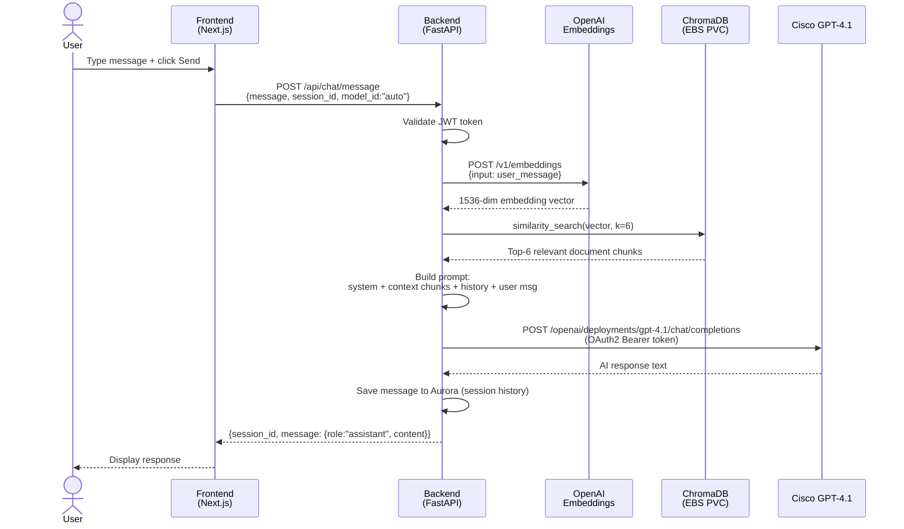
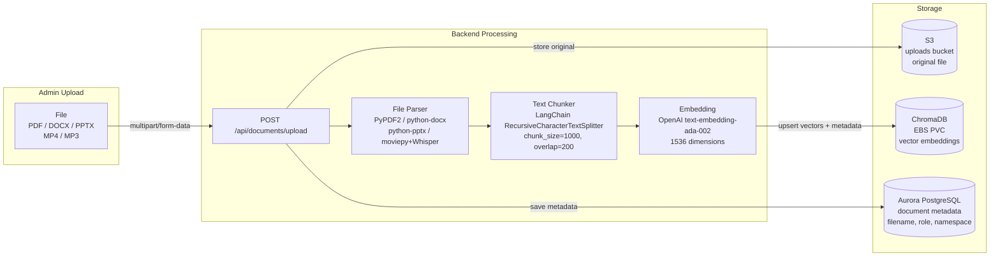
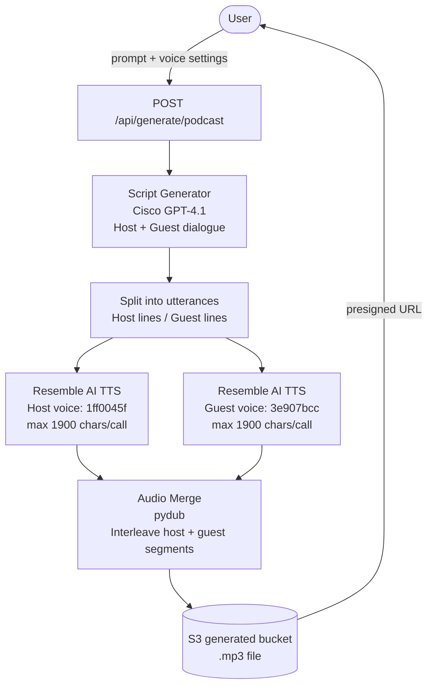
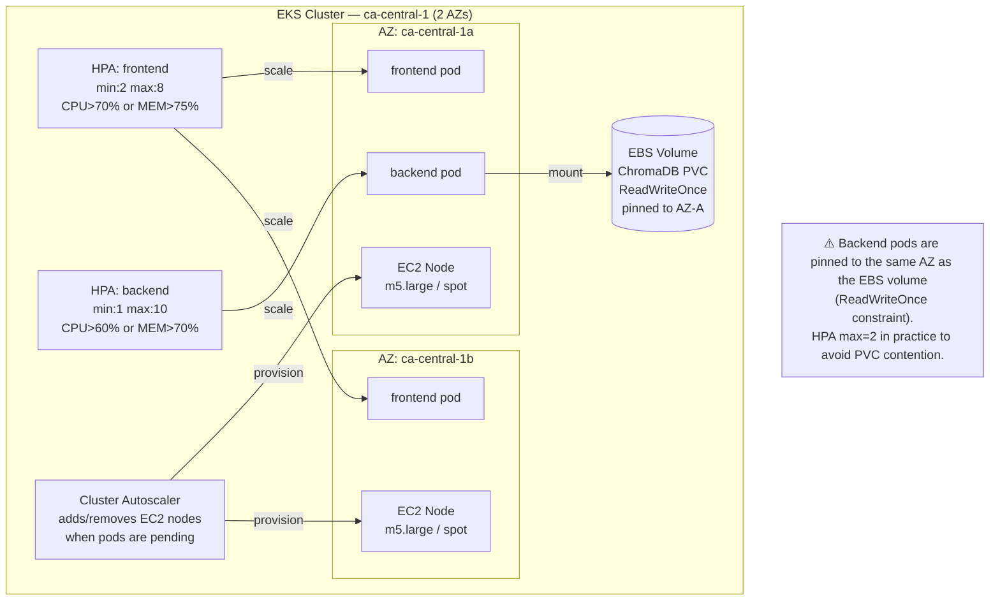
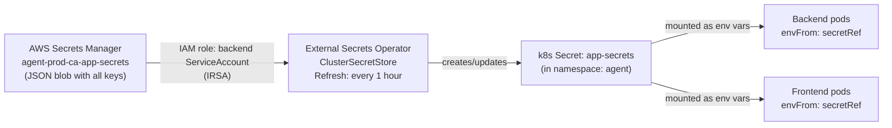
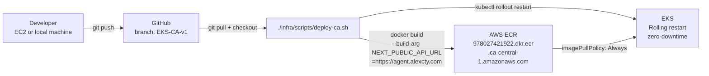

# AGENT Platform — Reference Architecture

**AWS EKS · ca-central-1 · Branch: EKS-CA-v1**

---

## End-to-End Request Flow

```mermaid
flowchart TD
    User(["👤 User Browser"])

    subgraph CDN["Edge / CDN"]
        CF["Cloudflare\nDNS + Proxy\nagent.alexcty.com"]
    end

    subgraph AWS_CA["AWS ca-central-1"]
        ALB["AWS ALB\n(Internet-facing)\nHTTPS :443 / HTTP :80→443 redirect\nACM TLS Certificate"]

        subgraph EKS["EKS Cluster — agent-prod-ca"]
            direction TB
            ING["ALB Ingress Controller\npath: / → frontend :3000\npath: /api → backend :8000"]

            subgraph FE_NS["frontend pods (HPA: 2–8)"]
                FE1["frontend-pod-1\nNext.js :3000"]
                FE2["frontend-pod-2\nNext.js :3000"]
            end

            subgraph BE_NS["backend pods (HPA: 1–10)"]
                BE1["backend-pod-1\nFastAPI uvicorn :8000\n2 workers · 4Gi RAM"]
                BE2["backend-pod-2\nFastAPI uvicorn :8000\n2 workers · 4Gi RAM"]
            end

            PVC[("EBS PVC\nchroma-vector-db\nChromaDB vectors")]
            SM_ESO["External Secrets Operator\nSecrets Manager → k8s Secret\napp-secrets"]
        end

        subgraph DATA["Managed Data Layer"]
            RDS[("Aurora PostgreSQL\nServerless v2\n0.5–8 ACU\nUsers, sessions, docs, onboarding")]
            S3_UP["S3 Bucket\nagent-prod-ca-uploads-*\nRaw uploaded files"]
            S3_GEN["S3 Bucket\nagent-prod-ca-generated-*\nPodcasts, slides, exports"]
        end

        SM["AWS Secrets Manager\nagent-prod-ca-app-secrets\nAll API keys + DB creds"]
        ECR["ECR\nBackend image\nFrontend image"]
    end

    subgraph AI["External AI Services"]
        CISCO["Cisco GPT-4.1\nchat-ai.cisco.com\nOAuth2 token exchange"]
        OAI["OpenAI API\nEmbeddings: text-embedding-ada-002\nTTS fallback"]
        RESEMBLE["Resemble AI\np.cluster.resemble.ai\nHigh-quality TTS"]
        PRESENTON["Presenton\n172.31.11.64:80\nPowerPoint generation"]
    end

    User -->|"HTTPS"| CF
    CF -->|"HTTPS (proxied)"| ALB
    ALB --> ING
    ING -->|"GET / assets"| FE1 & FE2
    ING -->|"POST /api/*"| BE1 & BE2

    BE1 & BE2 -->|"SQL"| RDS
    BE1 & BE2 -->|"vector read/write\n(ReadWriteOnce: same node)"| PVC
    BE1 & BE2 -->|"upload/download"| S3_UP
    BE1 & BE2 -->|"store generated files"| S3_GEN
    BE1 & BE2 -->|"chat completions\nOAuth2"| CISCO
    BE1 & BE2 -->|"embeddings\nTTS fallback"| OAI
    BE1 & BE2 -->|"TTS synthesis"| RESEMBLE
    BE1 & BE2 -->|"slide generation"| PRESENTON

    SM -->|"synced every 1h"| SM_ESO
    SM_ESO -->|"k8s Secret: app-secrets\nenvFrom in pods"| BE1 & BE2 & FE1 & FE2
    ECR -->|"imagePullPolicy: Always"| BE1 & BE2 & FE1 & FE2
```

---

## AI Chat — RAG Pipeline

---

## Document Ingestion Pipeline

---

## Podcast / Audio Generation

---

## Infrastructure — Scaling & Resilience

---

## Secrets Management Flow

---

## CI/CD — Code Update Workflow

---

## Component Inventory

| Component | Value |
|---|---|
| **Domain** | `agent.alexcty.com` |
| **CDN** | Cloudflare (DNS proxy) |
| **AWS Account** | `978027421922` |
| **Region** | `ca-central-1` |
| **EKS Cluster** | `agent-prod-ca` (Kubernetes 1.30) |
| **Namespace** | `agent` |
| **Backend ECR** | `978027421922.dkr.ecr.ca-central-1.amazonaws.com/agent-prod-ca-backend:latest` |
| **Frontend ECR** | `978027421922.dkr.ecr.ca-central-1.amazonaws.com/agent-prod-ca-frontend:latest` |
| **Aurora Cluster** | `agent-prod-ca-aurora` · PostgreSQL Serverless v2 |
| **S3 Uploads** | `agent-prod-ca-uploads-978027421922` |
| **S3 Generated** | `agent-prod-ca-generated-978027421922` |
| **Secrets** | `agent-prod-ca-app-secrets` (Secrets Manager) |
| **ALB** | `k8s-agent-3e85e4c1e2-*.ca-central-1.elb.amazonaws.com` |
| **TLS Cert** | ACM `arn:aws:acm:ca-central-1:978027421922:certificate/796de4c2-…` |
| **Node Types** | `m5.large`, `m5a.large` (on-demand + spot mix) |
| **Backend Resources** | Request: 500m CPU / 1Gi RAM · Limit: 2 CPU / 4Gi RAM |
| **Frontend Resources** | Request: 250m CPU / 256Mi RAM · Limit: 1 CPU / 1Gi RAM |

---

*AGENT Platform · Reference Architecture · EKS-CA-v1 · March 2026*
