# Reference Architecture - AGENT Platform

## Executive Summary

**AGENT** (AI for GSSO Engineering Team) is an enterprise-grade AI-powered platform that combines Retrieval Augmented Generation (RAG), document processing, and generative AI to enable employees to interact with business knowledge through natural language queries. The platform supports document management, semantic search, intelligent presentation generation, and audio synthesis.

---

## System Architecture Overview

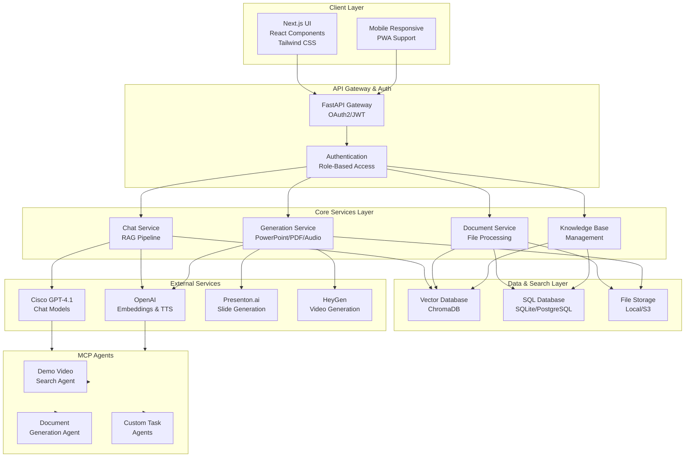

---

## Layered Architecture

### 1. Presentation Layer

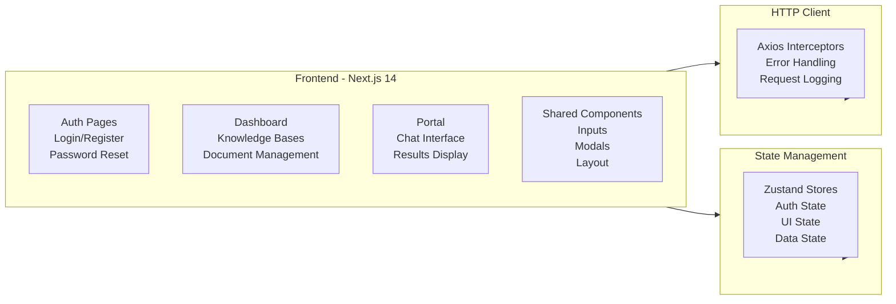

**Key Technologies:**
- **Framework**: Next.js 14 (App Router)
- **Language**: TypeScript
- **Styling**: Tailwind CSS + PostCSS
- **State**: Zustand (lightweight store)
- **HTTP**: Axios with custom interceptors
- **Icons**: Lucide React
- **Data Fetching**: React Query (@tanstack/react-query)

---

### 2. API & Authentication Layer

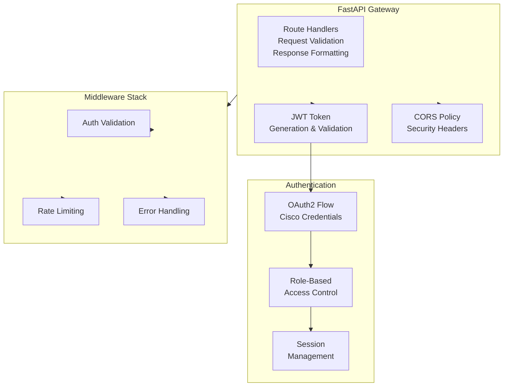

**API Endpoints:**
```
POST   /auth/login              - User login
POST   /auth/register           - User registration
POST   /auth/refresh            - Refresh JWT token
POST   /auth/logout             - Logout

GET    /knowledge-bases         - List knowledge bases
POST   /knowledge-bases         - Create knowledge base
GET    /knowledge-bases/{id}    - Get knowledge base details
PUT    /knowledge-bases/{id}    - Update knowledge base
DELETE /knowledge-bases/{id}    - Delete knowledge base

POST   /documents/upload        - Upload document
GET    /documents               - List documents
GET    /documents/{id}          - Get document details
DELETE /documents/{id}          - Delete document

POST   /chat/message            - Send chat message
GET    /chat/history/{session}  - Get chat history
GET    /chat/sessions           - List chat sessions

POST   /generate/powerpoint     - Generate PowerPoint
POST   /generate/document       - Generate Word/PDF
POST   /generate/audio          - Generate audio/podcast

GET    /agents/demo-video       - Search demo videos
GET    /agents/status           - MCP Agent status
```

---

### 3. Core Services Layer

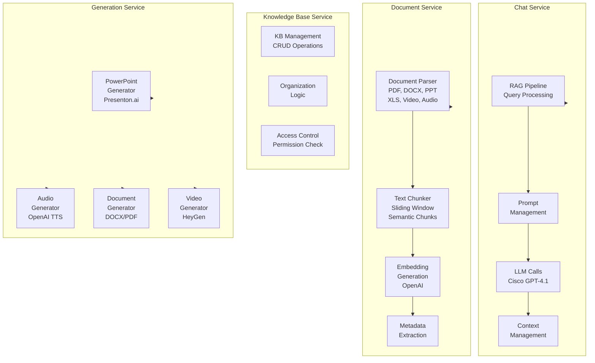

**Service Details:**

#### Chat Service
- Implements RAG pipeline with LangChain
- Manages conversation history and context
- Handles token counting and limits
- Routes to appropriate LLM (Cisco GPT-4.1)

#### Document Service
- Supports multiple file formats (PDF, DOCX, PPTX, XLS, MP4, MP3, etc.)
- Uses PyPDF2, python-docx, python-pptx, openpyxl, moviepy, openai-whisper
- Generates embeddings using OpenAI text-embedding-3-small
- Chunks documents with semantic awareness

#### Knowledge Base Service
- CRUD operations on knowledge bases
- Document organization and tagging
- Role-based access control
- Namespace isolation for privacy

#### Generation Service
- PowerPoint generation via Presenton.ai
- Text-to-Speech via OpenAI TTS API
- Document export (Word, PDF)
- Video synthesis via HeyGen

---

### 4. Data Access Layer

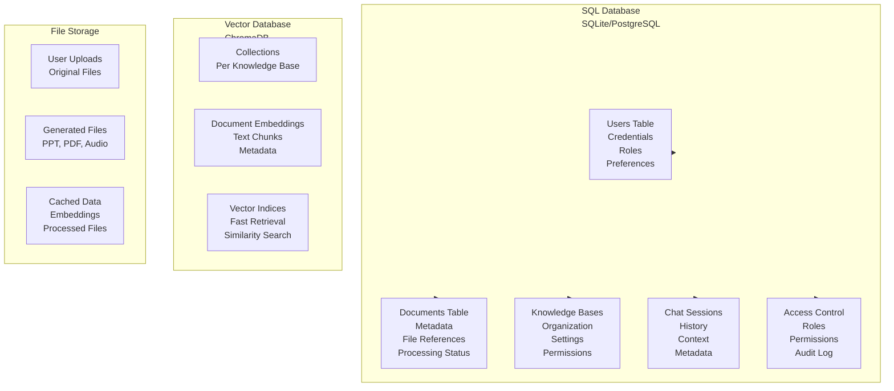

**Database Schema:**

```mermaid
erDiagram
    USERS ||--o{ KNOWLEDGE_BASES : owns
    USERS ||--o{ CHAT_SESSIONS : has
    KNOWLEDGE_BASES ||--o{ DOCUMENTS : contains
    DOCUMENTS ||--o{ DOCUMENT_CHUNKS : splits_into
    CHAT_SESSIONS ||--o{ MESSAGES : contains
    
    USERS {
        id PK
        email UK
        hashed_password
        role
        is_active
        created_at
    }
    
    KNOWLEDGE_BASES {
        id PK
        owner_id FK
        name
        description
        created_at
    }
    
    DOCUMENTS {
        id PK
        kb_id FK
        filename
        file_path
        file_type
        status
        uploaded_at
    }
    
    DOCUMENT_CHUNKS {
        id PK
        document_id FK
        content
        embedding_id
        metadata
    }
    
    CHAT_SESSIONS {
        id PK
        user_id FK
        kb_id FK
        title
        created_at
    }
    
    MESSAGES {
        id PK
        session_id FK
        role
        content
        timestamp
    }
```

---

### 5. MCP Agents Layer

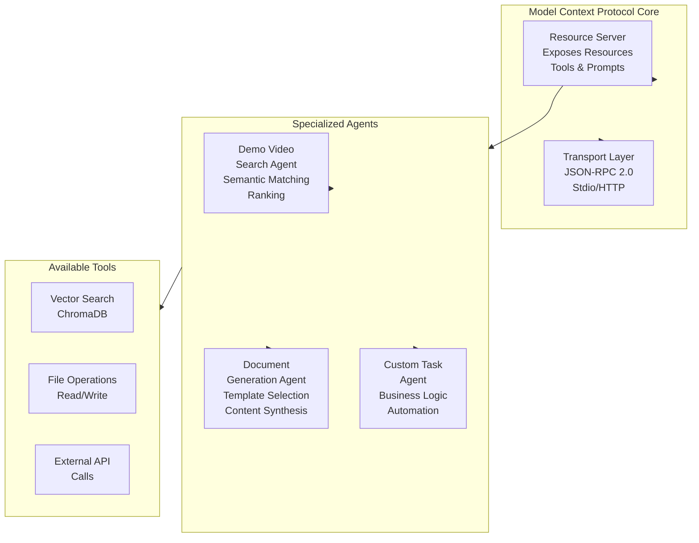

**MCP Agent Capabilities:**
- **Demo Video Search**: Intelligent semantic matching and ranking
- **Document Generation**: Template-based content synthesis
- **Custom Tasks**: Extensible for business-specific logic
- **Tool Access**: Vector search, file operations, API calls

---

## Data Flow Diagrams

### 1. Chat Query Flow (RAG Pipeline)

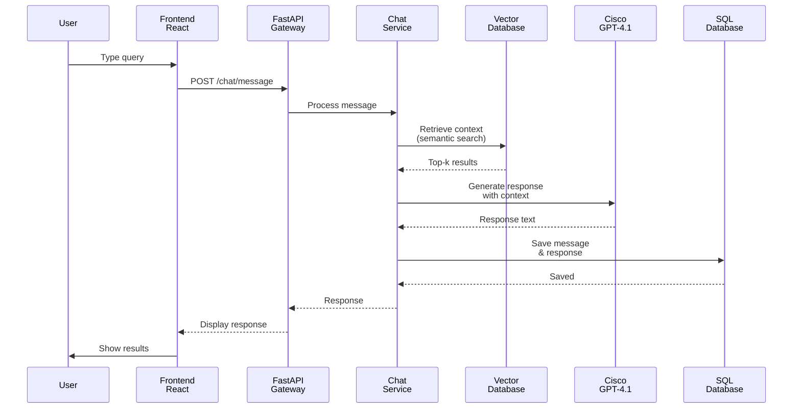

### 2. Document Upload & Processing Flow

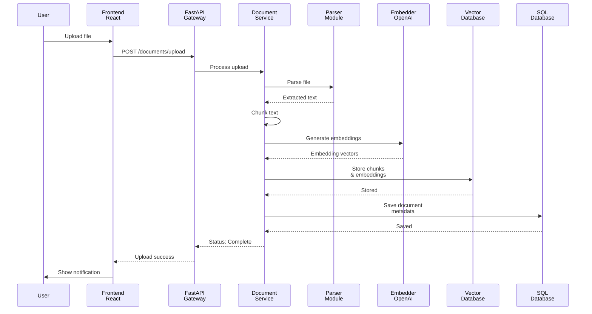

### 3. Content Generation Flow

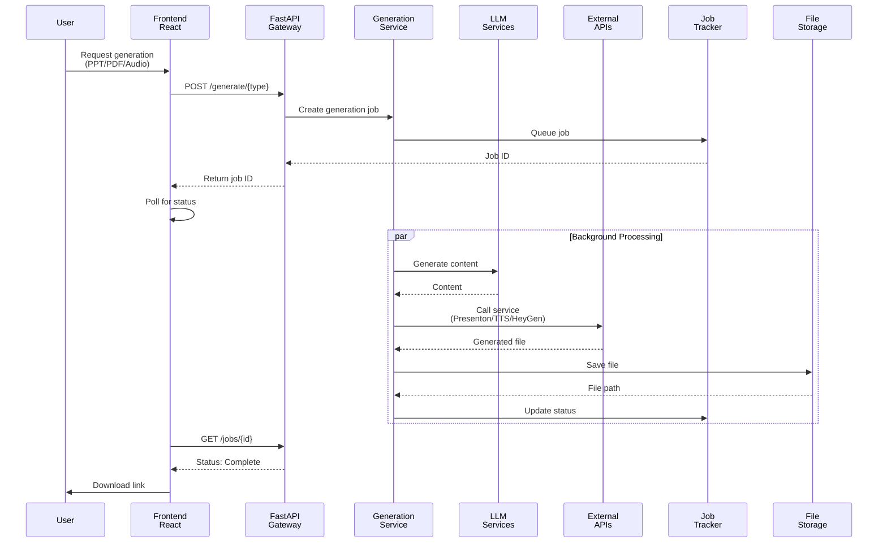

### 4. Authentication & Authorization Flow

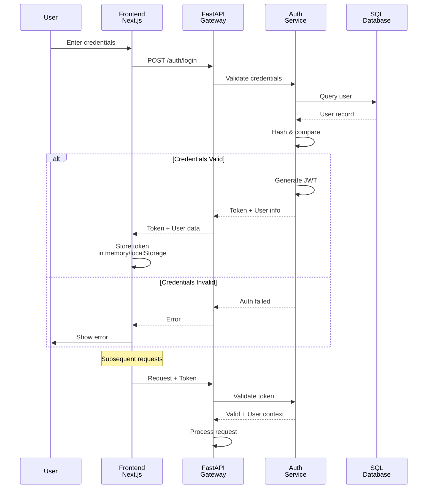

---

## Technology Stack

### Frontend Stack

| Component | Technology | Purpose |
|-----------|-----------|---------|
| Framework | Next.js 14 | Server-side rendering, App Router |
| Language | TypeScript | Type safety, development experience |
| Styling | Tailwind CSS | Utility-first CSS framework |
| State | Zustand | Lightweight state management |
| HTTP | Axios | REST API client with interceptors |
| Data Fetch | React Query | Server state management |
| UI Components | Lucide React | Icon library |
| UI/UX | React Dropzone | File upload handling |
| Build | Webpack/esbuild | Optimized bundling |

### Backend Stack

| Component | Technology | Purpose |
|-----------|-----------|---------|
| Framework | FastAPI | High-performance async API |
| Language | Python 3.10+ | Rapid development, ML libraries |
| Database | SQLite/PostgreSQL | Relational data storage |
| Vector DB | ChromaDB | Vector embeddings storage |
| RAG | LangChain | RAG pipeline orchestration |
| Document Processing | PyPDF2, python-docx, python-pptx, openpyxl, moviepy | Multi-format support |
| Speech Recognition | OpenAI Whisper | Audio-to-text transcription |
| Async Jobs | Background tasks | Non-blocking operations |
| ORM | SQLAlchemy | Database abstraction |

### External Services

| Service | Purpose | Authentication |
|---------|---------|-----------------|
| Cisco GPT-4.1 | Chat completions, embeddings | OAuth2 |
| OpenAI | Embeddings (text-embedding-3-small), TTS | API Key |
| Presenton.ai | PowerPoint generation | API Key |
| HeyGen | Video synthesis | API Key |

---

## Deployment Architecture

### Development Deployment

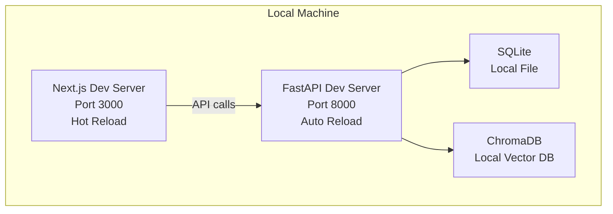

### Production Deployment

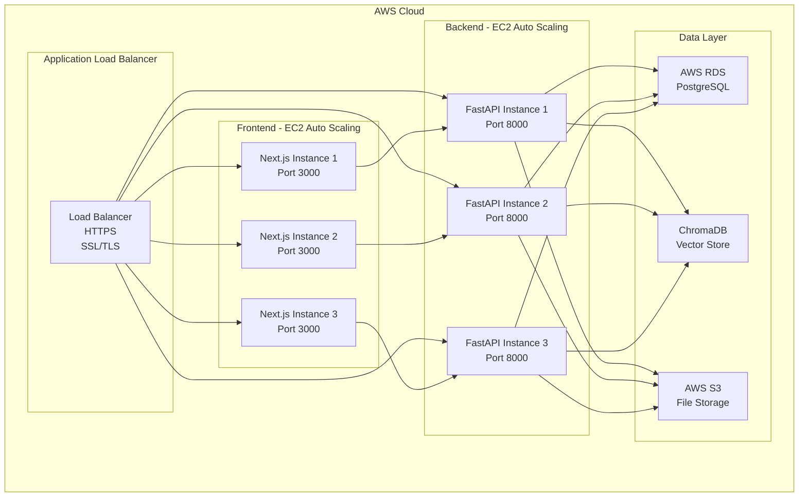

---

## Security Architecture

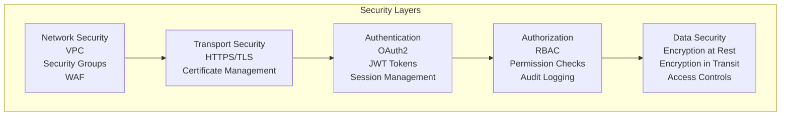

**Security Measures:**
- **Network**: VPC isolation, security groups, NACLs
- **Transport**: HTTPS/TLS for all communications
- **Authentication**: OAuth2 with Cisco credentials, JWT tokens
- **Authorization**: Role-Based Access Control (RBAC)
- **Data Protection**: Encrypted credentials, audit logging
- **Input Validation**: FastAPI request validation

---

## Integration Points

### External APIs

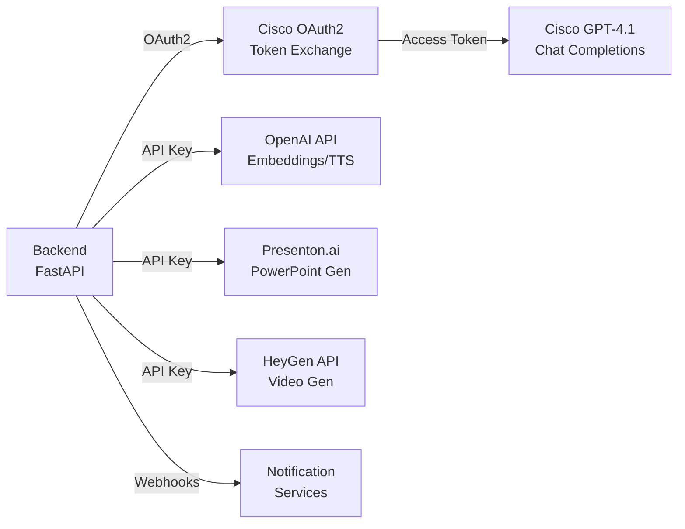

---

## Scalability & Performance

### Horizontal Scaling

```
Frontend Scaling:
- Stateless Next.js instances
- Load balanced across multiple instances
- Session data in JWT (stateless)
- Can scale to 100+ instances

Backend Scaling:
- Stateless FastAPI instances
- Async request handling (uvicorn workers)
- Connection pooling for databases
- Can scale to 50+ instances

Database Scaling:
- SQL: PostgreSQL read replicas for read-heavy workloads
- Vector DB: Partitioning by knowledge base
- File Storage: AWS S3 with CloudFront CDN
```

### Caching Strategy

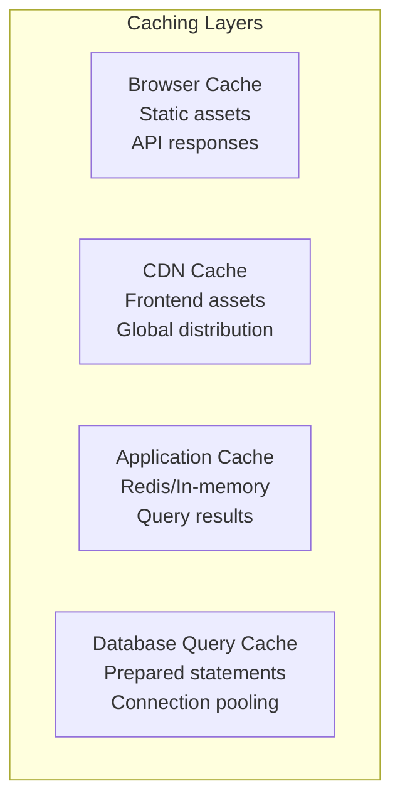

---

## Monitoring & Observability

### Logging

```
- **Frontend**: Browser console logs, Sentry integration
- **Backend**: FastAPI logging, structured JSON logs
- **Database**: Query logs, slow query monitoring
- **Vector DB**: Operation logs, performance metrics
```

### Metrics

```
- Request latency (p50, p95, p99)
- Error rates by endpoint
- Database query performance
- Vector search latency
- External API response times
- Resource utilization (CPU, memory, disk)
```

### Tracing

```
- Distributed tracing for request flows
- Correlation IDs for debugging
- Trace sampling for performance
```

---

## Deployment Checklist

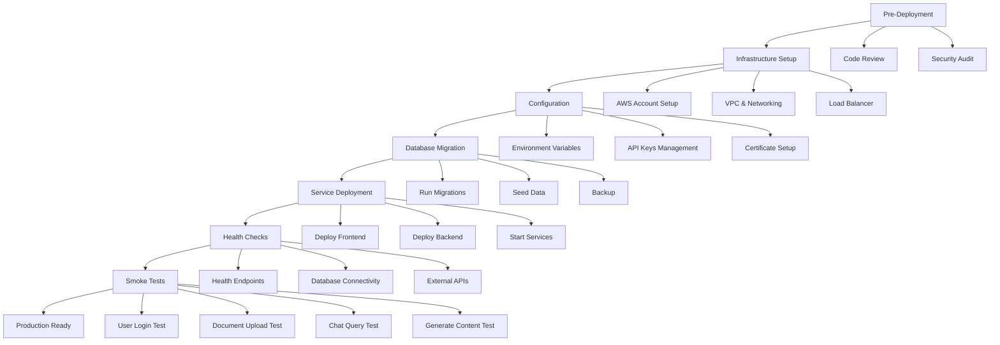

---

## Performance Optimization

### Frontend Optimization

```
- Code splitting with Next.js dynamic imports
- Image optimization with next/image
- CSS-in-JS minimization
- Bundle analysis and tree-shaking
- Service worker for PWA capabilities
- Asset compression (gzip/brotli)
```

### Backend Optimization

```
- Async request handling with FastAPI
- Connection pooling (database, external APIs)
- Query optimization and indexing
- Batch processing for bulk operations
- Rate limiting and backpressure
- Background job processing
```

### Database Optimization

```
- Indexed columns for fast queries
- Partitioned tables for large datasets
- Query optimization and explain plans
- Connection pooling
- Read replicas for read-heavy workloads
```

---

## Disaster Recovery

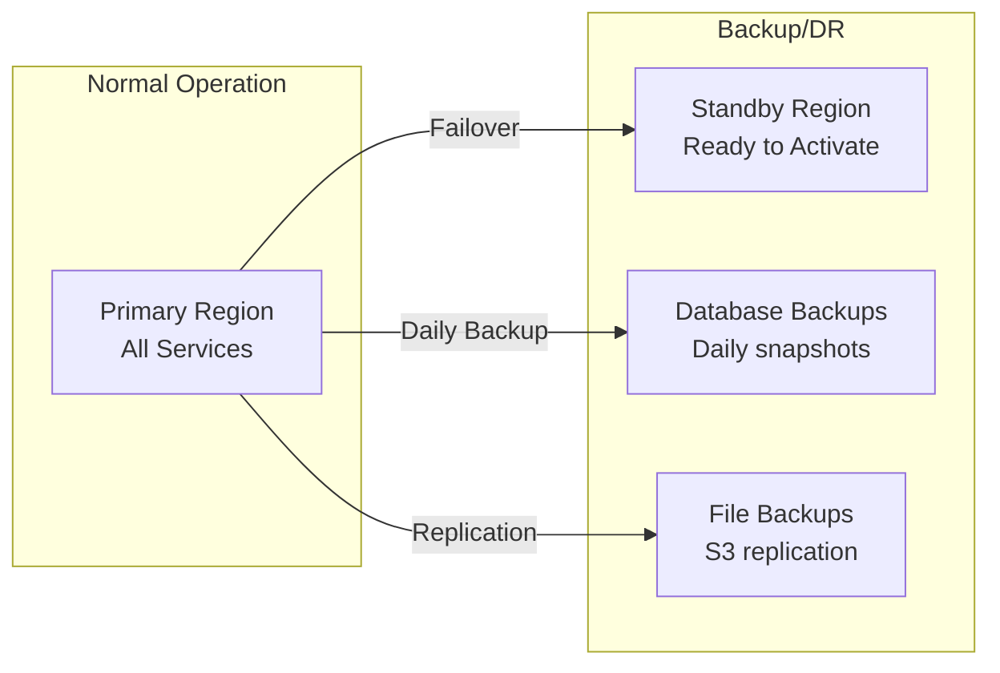

**RTO/RPO Targets:**
- Recovery Time Objective (RTO): < 1 hour
- Recovery Point Objective (RPO): < 24 hours
- Backup frequency: Daily automated snapshots

---

## Future Enhancements

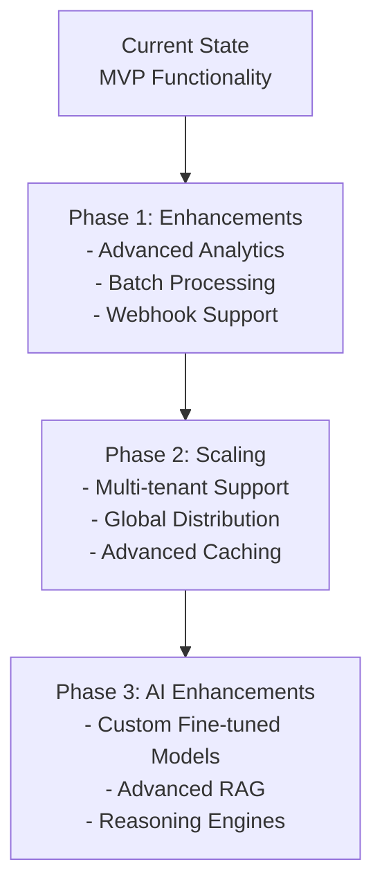

---

## Reference Documentation

- [Deployment Guide](./docs/AWS_EC2_DEPLOYMENT_GUIDE.md)
- [Technical Documentation](./docs/TECHNICAL_DOCUMENTATION.md)
- [Installation Manual](./INSTALL.md)
- [Onboarding Guide](./ONBOARDING_COMPLETE.md)

---

**Last Updated**: January 15, 2026  
**Version**: 1.0.0  
**Architecture Owner**: AGENT Development Team
