# AGENT Platform — Architecture Documentation

**GSSO AI Center · AWS EKS · ca-central-1 · Branch: `EKS-CA-v1`**

This document describes the full system architecture of the AGENT platform — an AI-powered sales enablement platform for Cisco's GSSO Engineering Team.

---

## Table of Contents

1. [System Overview](#1-system-overview)
2. [End-to-End Request Flow](#2-end-to-end-request-flow)
3. [Frontend Architecture](#3-frontend-architecture)
4. [Backend Architecture](#4-backend-architecture)
5. [RAG Chat Pipeline](#5-rag-chat-pipeline)
6. [Document Ingestion Pipeline](#6-document-ingestion-pipeline)
7. [Podcast Generation Pipeline](#7-podcast-generation-pipeline)
8. [PowerPoint Generation Pipeline](#8-powerpoint-generation-pipeline)
9. [Authentication & Authorization Flow](#9-authentication--authorization-flow)
10. [Database Schema](#10-database-schema)
11. [Infrastructure & Scaling](#11-infrastructure--scaling)
12. [Secrets Management](#12-secrets-management)
13. [CI/CD & Deployment Pipeline](#13-cicd--deployment-pipeline)
14. [External Service Integrations](#14-external-service-integrations)

---

## 1. System Overview

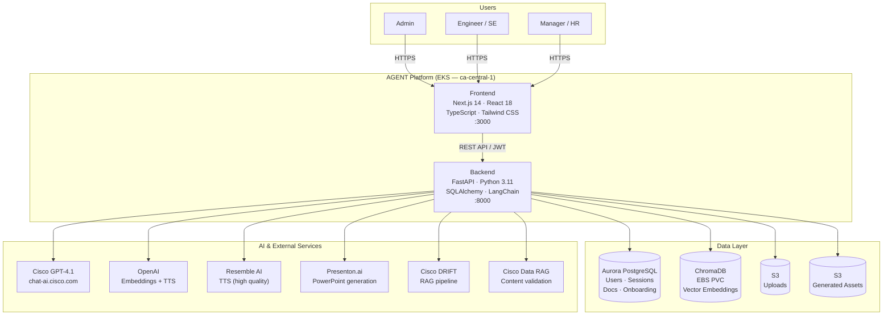

---

## 2. End-to-End Request Flow

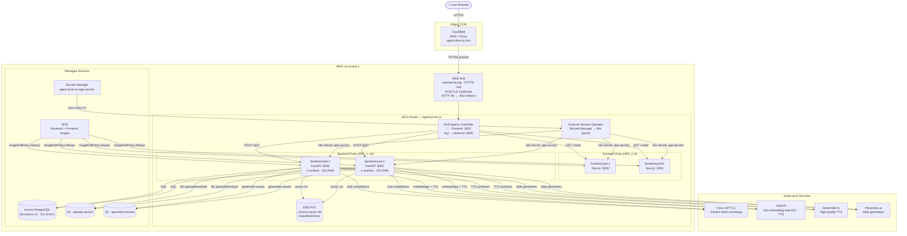

---

## 3. Frontend Architecture

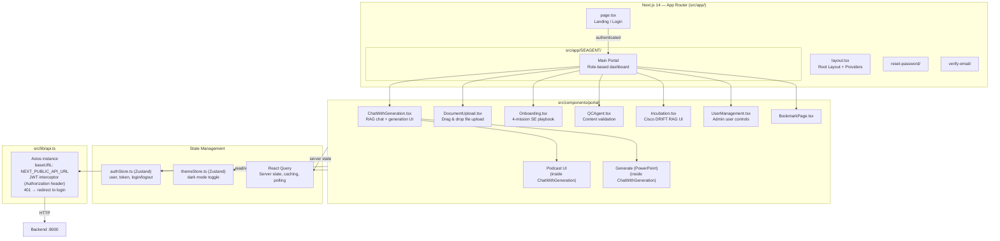

---

## 4. Backend Architecture

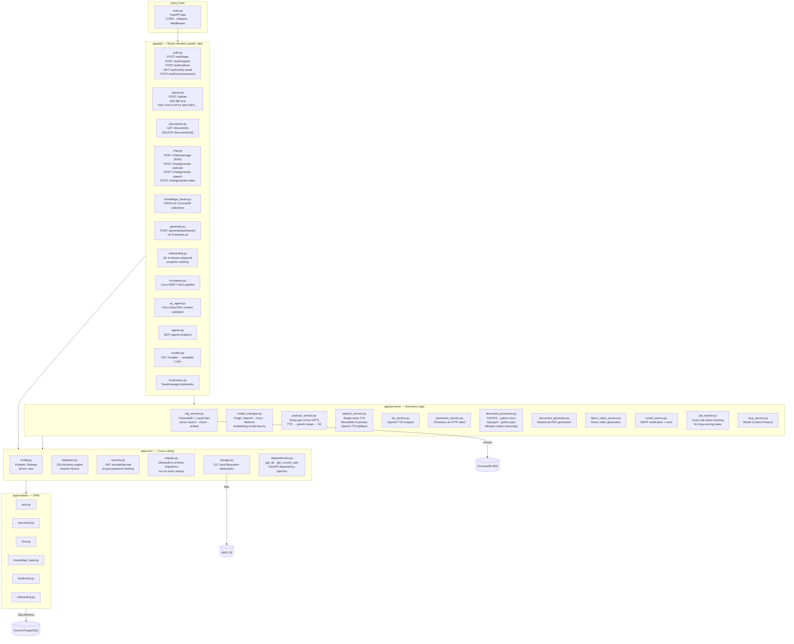

---

## 5. RAG Chat Pipeline

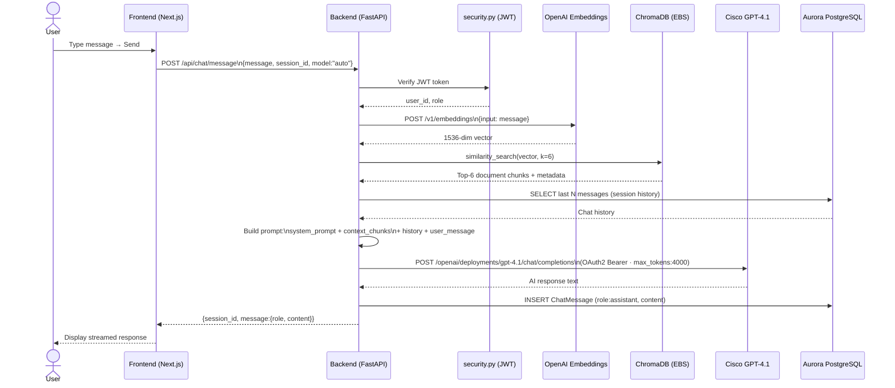

---

## 6. Document Ingestion Pipeline

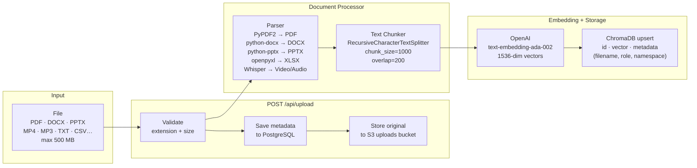

---

## 7. Podcast Generation Pipeline

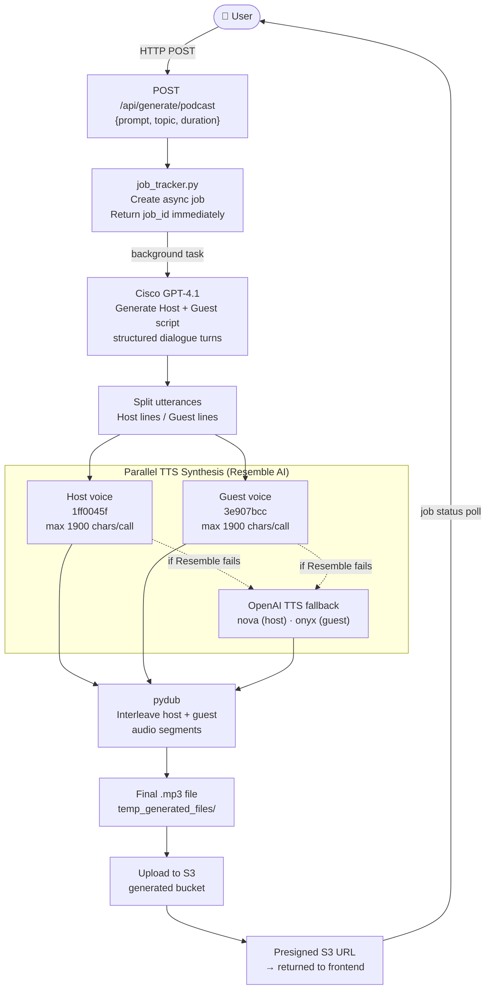

---

## 8. PowerPoint Generation Pipeline

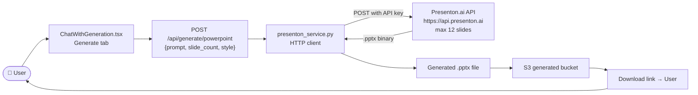

---

## 9. Authentication & Authorization Flow

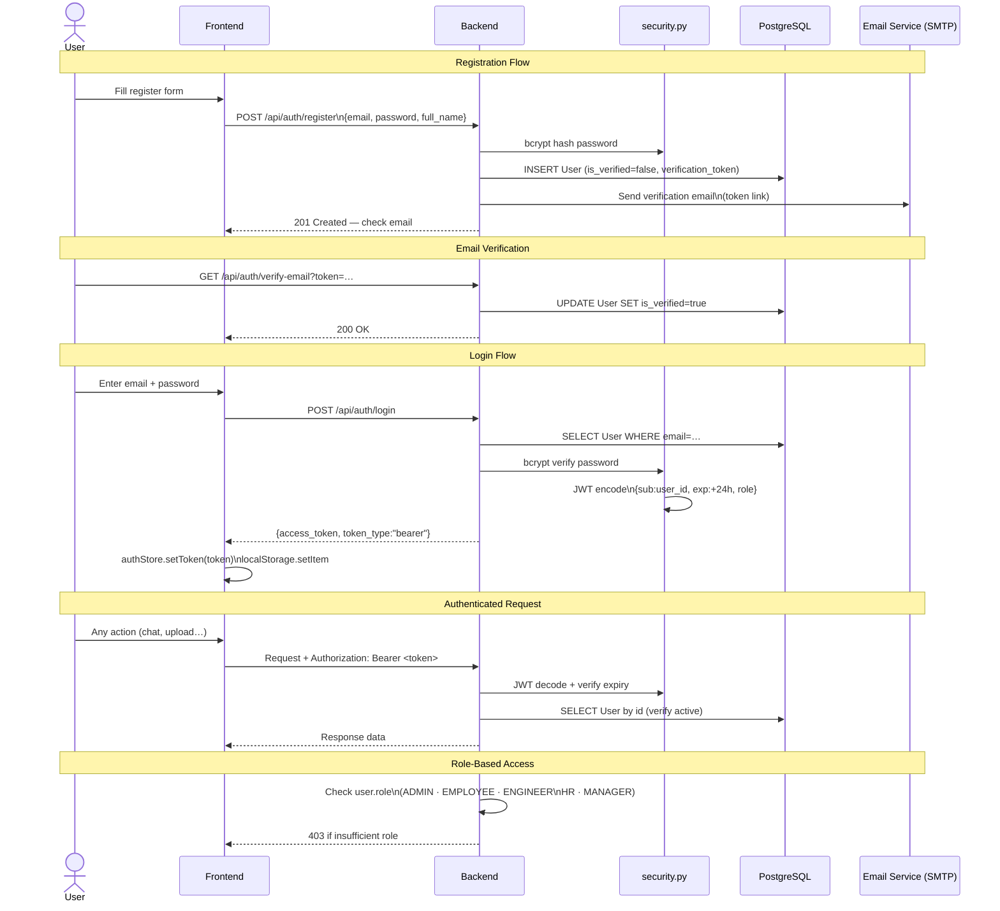

---

## 10. Database Schema

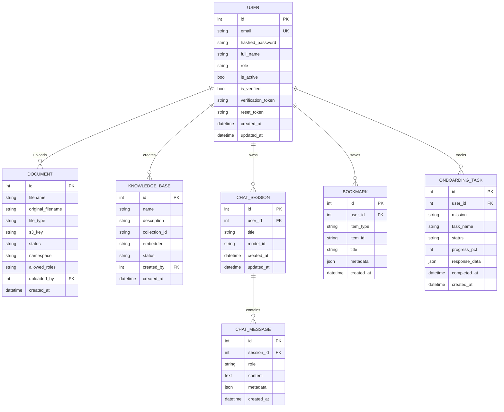

---

## 11. Infrastructure & Scaling

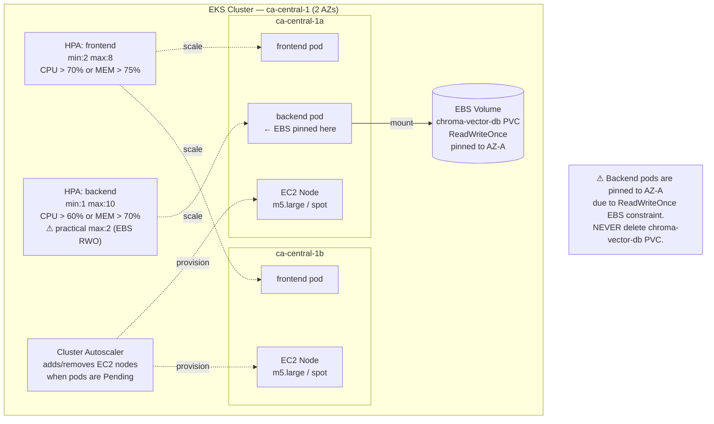

---

## 12. Secrets Management

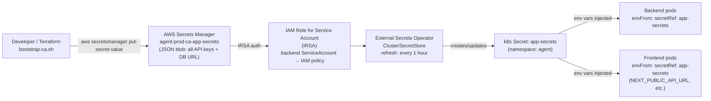

**Key secrets** (see [infra/secrets-template.json](infra/secrets-template.json)):

| Key | Purpose |
|-----|---------|
| `DATABASE_URL` | Aurora PostgreSQL connection string |
| `SECRET_KEY` | JWT signing key (min 32 chars) |
| `OPENAI_API_KEY` | Embeddings + TTS fallback |
| `CISCO_CLIENT_ID/SECRET` | Cisco GPT-4.1 OAuth2 |
| `DRIFT_CLIENT_ID/SECRET` | Cisco DRIFT RAG (Incubation) |
| `QC_CLIENT_ID/SECRET/APP_ID` | Cisco Data RAG (QC Agent) |
| `PRESENTON_API_KEY` | PowerPoint generation |
| `MAIL_USERNAME/PASSWORD` | SMTP email verification |

---

## 13. CI/CD & Deployment Pipeline

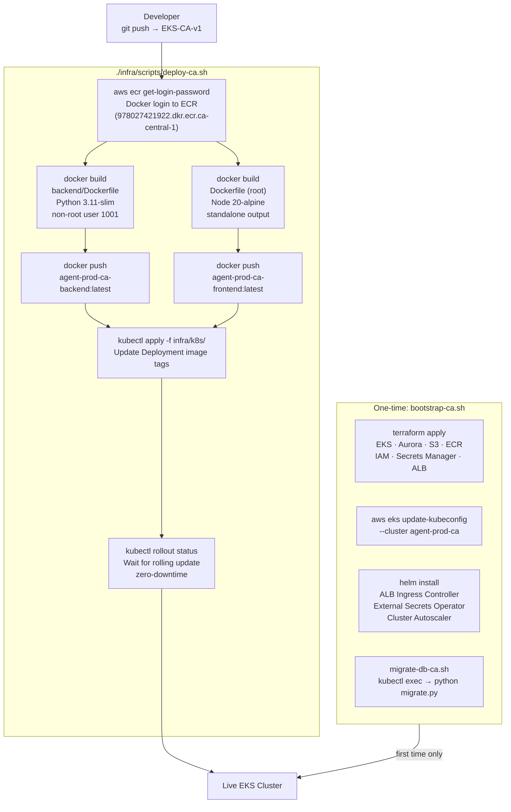

**Startup sequence inside each pod:**

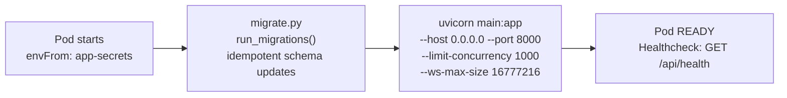

---

## 14. External Service Integrations

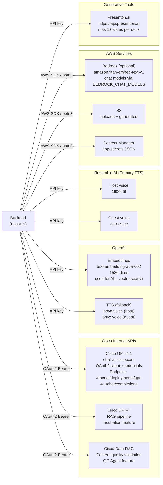

---

> **See also:**
> - [REFERENCE_ARCHITECTURE.md](REFERENCE_ARCHITECTURE.md) — original end-to-end flow + RAG sequence diagrams
> - [docs/TECHNICAL_DOCUMENTATION.md](docs/TECHNICAL_DOCUMENTATION.md) — API reference & DB schema detail
> - [docs/EKS_CA_DEPLOYMENT_GUIDE.md](docs/EKS_CA_DEPLOYMENT_GUIDE.md) — cluster setup walkthrough
> - [docs/RAG_IMPROVEMENT_ANALYSIS.md](docs/RAG_IMPROVEMENT_ANALYSIS.md) — RAG tuning notes
> - [infra/secrets-template.json](infra/secrets-template.json) — all required secret keys
